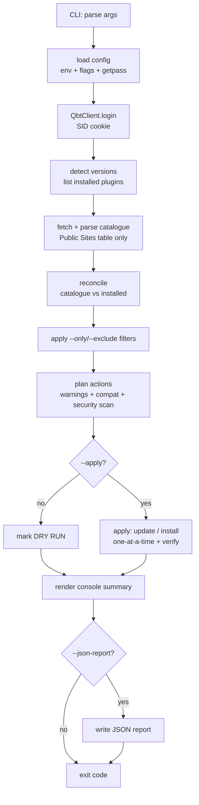
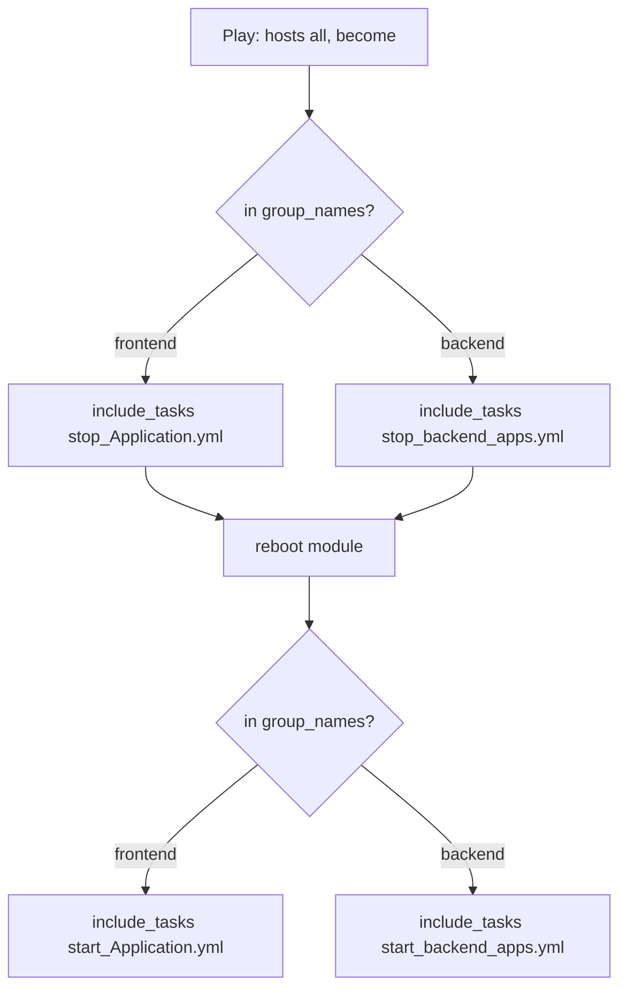

# Architecture

This document describes how the repository is organised and the design of each
project it contains. It complements — and does not replace — each project's own
`README.md`.

---

## Repository model

`devops-labs-tchize` is a **monorepo**. Each project is an independent,
self-contained unit in its own top-level directory:

```text
devops-labs-tchize/
├── <repo-wide docs & meta>        # README, CONTRIBUTING, SECURITY, CHANGELOG, .github/, docs/
└── <project-dir>/                 # one directory per project
    ├── README.md                  # project source-of-truth documentation
    ├── <source>                   # project code
    ├── tests/                     # project tests
    └── <dependency manifest>      # e.g. requirements.txt
```

**Design principles applied repository-wide:**

- **Isolation** — a project owns its dependencies, tests, and docs; changes stay
  scoped to one directory.
- **Safe by default** — anything that mutates external state defaults to a dry
  run / no-op and requires an explicit opt-in flag.
- **Auditability** — actions are logged and verifiable; artefacts (reports,
  hashes) make runs reproducible and reviewable.
- **No secrets in the tree** — credentials come from the environment or prompts;
  only `.env.example` templates are tracked.
- **Deterministic tests** — no test performs real network mutations.

---

## Projects

### qbittorrent-plugin-sync

A command-line tool that synchronises the unofficial **Plugins for Public Sites**
qBittorrent search plugins with a running qBittorrent instance, using the WebUI
API rather than editing qBittorrent's plugin directories directly.

#### Module layout

| Module | Responsibility |
| ------ | -------------- |
| `qbt_plugin_sync.py` | Thin entry point; delegates to `qbt_sync.cli`. |
| `qbt_sync/cli.py` | Argument parsing and orchestration (reconcile → plan → apply → verify → report), plus console rendering and process exit codes. |
| `qbt_sync/config.py` | Resolves configuration from CLI flags, environment, and defaults; handles the password via env var or `getpass` (never a CLI arg). |
| `qbt_sync/qbittorrent.py` | WebUI API client: persistent `requests.Session`, SID cookie, correct Referer/Origin, typed error hierarchy, install verification. |
| `qbt_sync/catalogue.py` | State-machine parser for the canonical MediaWiki catalogue; extracts **only** the Public Sites table. |
| `qbt_sync/matcher.py` | Name/URL normalisation and multi-signal, confidence-thresholded matching between catalogue and installed plugins. |
| `qbt_sync/versions.py` | `packaging.Version`-based comparison; never lexicographic; surfaces `UNKNOWN`/`UNKNOWN_VERSION`. |
| `qbt_sync/security.py` | URL validation and static `ast` inspection (non-executing) with SHA-256 and risk scoring. |
| `qbt_sync/httpclient.py` | Retrying GETs and validated redirect-following with size caps. |
| `qbt_sync/models.py` | Dataclasses and enums shared across the tool. |
| `qbt_sync/report.py` | Builds the credential-free JSON report. |
| `qbt_sync/logging_config.py` | Logging setup plus a secret-redaction filter. |

#### Execution pipeline



#### Safety model

Because unofficial plugins are arbitrary executable Python:

1. **URL validation** — HTTPS-only; rejects `file://`, localhost, and
   private/internal IPs (IPv4 and IPv6), with every redirect hop re-validated.
2. **Bounded download** — fetched into memory under a 2 MB cap.
3. **Static inspection** — parsed with `ast` **without execution**; dangerous
   constructs (`subprocess`, `os.system`, `eval`/`exec`, `pickle`, `ctypes`,
   dynamic import, sockets, filesystem mutation) are flagged and risk-scored.
4. **Provenance** — a SHA-256 of every inspected source is recorded in the
   report.
5. **Human gates** — `❗`/`✖`-flagged and HIGH-risk plugins are skipped by
   default and require explicit `--include-discouraged` / `--include-suspicious`
   overrides *and* `--apply` to act.

This is a **heuristic** defence, not a guarantee — see
[`SECURITY.md`](../SECURITY.md).

#### Exit codes

| Code | Meaning |
| ---- | ------- |
| `0` | Success / dry run completed |
| `1` | Partial plugin failures |
| `2` | Configuration error |
| `3` | qBittorrent connection/authentication failure |
| `4` | Catalogue retrieval/parsing failure |

#### Testing strategy

The suite is fully offline: the WebUI client is exercised against a fake HTTP
session, catalogue parsing runs against a fixture, and every mutation is mocked —
no test installs a real plugin or touches a live qBittorrent. See the project
README's *Development / testing* section.

#### Automation model

Required CI uses a Python 3.11–3.13 matrix and runs entirely within the project
directory. Compilation and offline tests run on every supported version; Ruff
and coverage run once on Python 3.11. Security automation is separated into
CodeQL (GitHub's default code scanning setup), dependency review, and a runtime
dependency audit so repository feature availability does not obscure the core
test signal. No workflow executes the
CLI, downloads plugin source, supplies credentials, or contacts qBittorrent.

The project is currently source-run rather than packaged: there is no build
backend or distribution metadata. Tag-driven GitHub/PyPI release automation is
therefore intentionally deferred until a separate packaging design is approved.

---

### Ansible / Vagrant lab

A local lab for practising Ansible against disposable virtual machines. Unlike
the other project, its files currently live at the **repository root** rather
than in a dedicated directory — a known deviation from the monorepo shape, kept
as-is while the lab is still an evolving learning scaffold.

#### Topology

[Vagrant](https://www.vagrantup.com/) provisions three CentOS 8 VMs on a shared
host-only network plus a bridged public interface:

| VM (`vm.define`) | Hostname | Private IP | Role |
| ---------------- | -------- | ---------- | ---- |
| `ansible_tower` | `ansible-tower` | `192.168.56.10` | Ansible Tower control node |
| `deploy_env1` | `deploy-env1` | `192.168.56.11` | Deployment target |
| `deploy_env2` | `deploy-env2` | `192.168.56.12` | Deployment target |

Each VM runs the same shell provisioner (`scripts/updateCentos.sh`) with
`privileged: true`. Because CentOS 8 is end-of-life, that script first repoints
the repos at the `vault.centos.org` mirror, then updates and installs
`net-tools` and `python3` using `dnf`. The public interface is bridged onto a
deterministic NIC selected via the `VAGRANT_BRIDGE` environment variable
(default `eth0`) so `vagrant up` does not prompt or pick an adapter at random on
multi-NIC hosts.

#### File layout

| File | Responsibility |
| ---- | -------------- |
| `Vagrantfile` | VM definitions, networking, and the bootstrap provisioner. |
| `Vagrantfile_back` | A loop-based alternative Vagrant configuration kept for reference. |
| `scripts/updateCentos.sh` | Idempotent VM bootstrap; runs as root under the Vagrant provisioner (no `sudo`), with `set -euo pipefail`. |
| `group_vars/all.yml` | Shared vars (`userBox`, environment names, private-key paths). Paths derive from `playbook_dir` rather than a hardcoded absolute path; the directory follows Ansible's standard `group_vars/` name so vars auto-load. |
| `inventories/hosts/hosts` | Static INI inventory: `instance_group`, `tower`, and `workernodes`. Private-key paths are plain relative paths under `.vagrant/machines/<name>/` (INI inventories are not Jinja-templated). |
| `towerinstall.yml` | Installs EPEL + Ansible, downloads and unpacks the Tower setup tarball under `/opt`, and runs `setup.sh`. Targets the `tower` group with a quoted `become_user`. |
| `test_connection.yml` | Connectivity smoke test using `ansible.builtin.ping` against `instance_group`. |
| `reboot_Application.yml` | Application-aware reboot workflow. |
| `reboot_Application-v2.yml` | Rolling-reboot variant. |

#### Reboot orchestration

Two complementary approaches to rebooting application hosts are provided:

- **`reboot_Application.yml`** classifies hosts by **inventory group
  membership** (`'frontend' in group_names` / `'backend' in group_names`)
  rather than deriving a role at runtime. It stops the relevant application,
  reboots via `ansible.builtin.reboot`, and starts it again, using
  `include_tasks` for the per-application steps.



- **`reboot_Application-v2.yml`** takes a fleet-availability angle: `serial: 1`
  reboots hosts **one at a time**, waiting for each to come back
  (`wait_for_connection`) and pass a `ping` before proceeding, so the group is
  never fully down at once. It is self-contained and does not depend on external
  stop/start task files.

#### Status and caveats

This is a **learning scaffold**, not a hardened deployment:

- The per-application `stop_*` / `start_*` task files referenced by
  `reboot_Application.yml`, and the `frontend` / `backend` inventory groups it
  keys on, are **placeholders** for future work — that playbook is illustrative
  rather than runnable end to end today.
- There is no CI for the lab; it is validated manually (YAML/INI parsing, shell
  and Ruby syntax) rather than by an automated suite.

---

## Adding a project

New projects follow the same shape: a dedicated top-level directory with its own
`README.md`, dependency manifest, and tests; a row in the root README's
**Projects** table; and a short design note added to this document. See
[`CONTRIBUTING.md`](../CONTRIBUTING.md).
